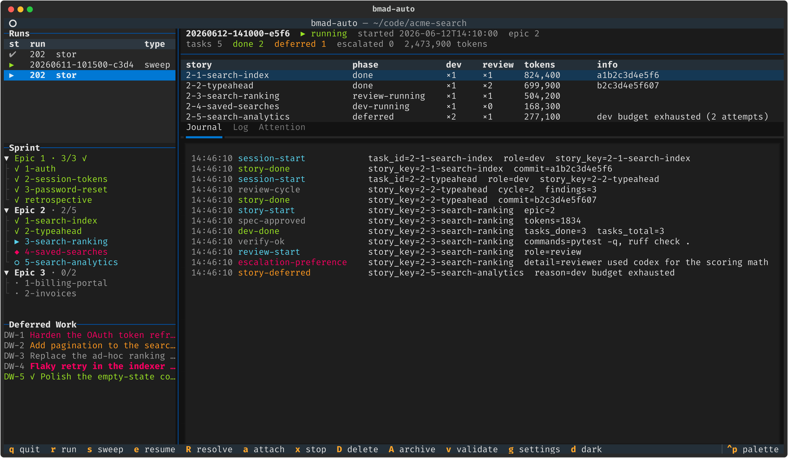
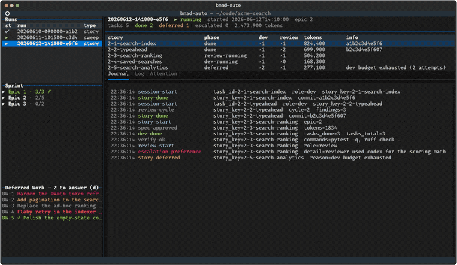
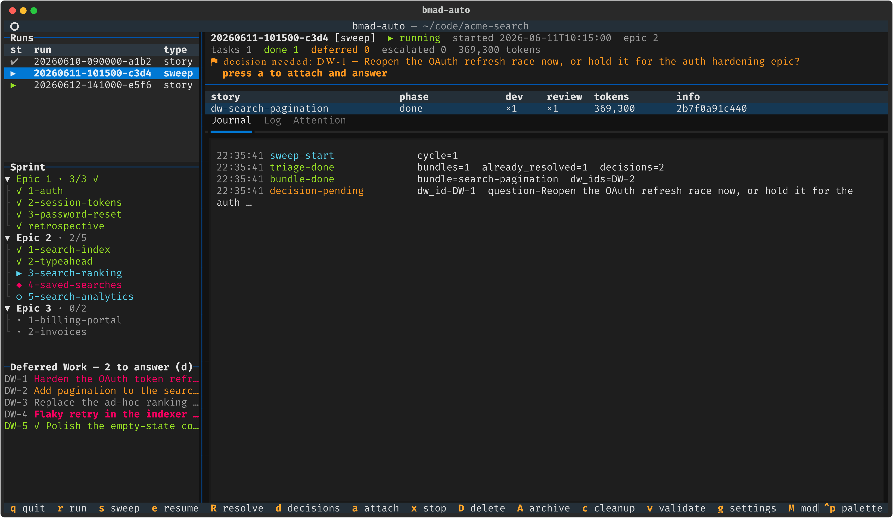
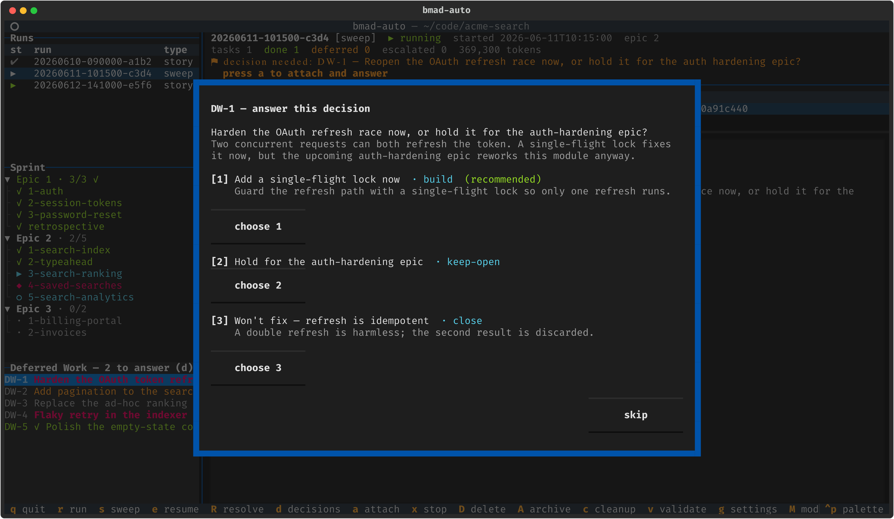
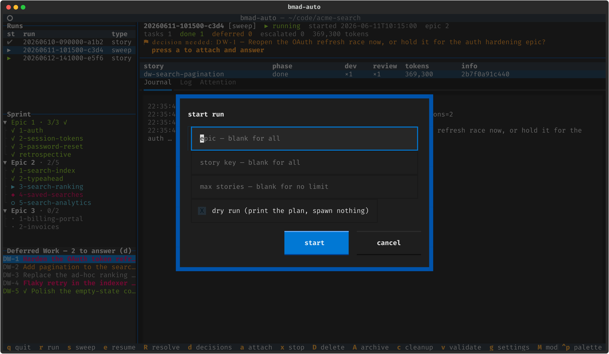

# bmad-auto

<div align="center">

**A deterministic ralph-loop orchestrator for the [BMAD-METHOD](https://github.com/bmad-code-org/BMAD-METHOD) implementation phase**

Plain Python drives the loop — **pick story → implement → adversarially review → verify → commit** — while LLMs do only the creative work, inside disposable, fresh-context coding-agent sessions you can attach to and watch.

[](https://github.com/pbean/bmad-automator/actions/workflows/ci.yml)




<sub>The live TUI dashboard — run picker, sprint tree, deferred-work ledger, per-story task table, and a tailing journal. <a href="#the-tui">Jump to the TUI tour ↓</a></sub>



<sub>A tour of the dashboard — walking the runs table, unfolding the sprint tree, opening a deferred-work entry, answering a decision a past sweep left unanswered, typing a story into the start-run modal, a sweep blocked on a decision, and scrolling the policy editor. <a href="#the-tui">More on the TUI ↓</a></sub>

</div>

---

## Why bmad-auto

Inspired by the official [bmad-automator](https://github.com/bmad-code-org/bmad-automator), it takes a token-optimized approach in which the orchestrator is ordinary code rather than an LLM session in the control loop:

- 🧠 **No LLM in the control loop.** Story selection, retry budgets, gates, and completion checks are code, not prompts — so they're deterministic, debuggable, and free.
- 📡 **No pane-scraping.** Coding-agent hooks (`Stop` / `SessionStart` / `SessionEnd` / `PreCompact`) write structured event files the orchestrator watches; skills in automation mode write a machine-readable `result.json` at the end of each workflow.
- 🔍 **Trust nothing, verify everything.** After each session the orchestrator checks artifacts on disk: spec frontmatter status, baseline-commit match (recorded independently — a cheap LLM-lie detector), non-empty diff, sprint-status sync, and _your_ test/lint commands before any commit.
- 📒 **One source of truth.** `sprint-status.yaml` is owned by the BMAD skills; the orchestrator only ever reads it.
- 🪟 **Fresh context per step.** Dev and review are separate sessions — review never inherits the implementer's context, so there's no anchoring bias.
- ♻️ **Resumable & multi-agent.** Every run is a resumable state machine on disk, and a generic tmux adapter drives `claude`, `codex`, or `gemini` (mix per stage).

## Requirements

- **Python 3.11+**, **tmux**, and a supported coding CLI — `claude` by default; `codex` and `gemini` via [profiles](#other-coding-clis).
- A **BMAD v6 project** (`_bmad/bmm/config.yaml`, a `sprint-status.yaml` from `bmad-sprint-planning`) with the automator skill module from this repo installed (`bmad-auto-dev`, `bmad-auto-review`, `bmad-auto-sweep` — see [Installing the skill module](#installing-the-skill-module)). Standard BMAD skills stay untouched.

## Quick start

```bash
uv sync --extra tui              # core is pyyaml-only; [tui] adds the dashboard

cd /path/to/your/bmad/project
bmad-auto init                   # installs bmad-auto-* skills + hooks + .automator/policy.toml + gitignore
bmad-auto validate               # preflight: config, sprint-status, git, tmux, CLI, hooks
bmad-auto run --dry-run          # print the plan without spawning anything
bmad-auto run                    # go
bmad-auto tui                    # …or drive everything from the dashboard
```

> **One-time setup:** if the coding CLI has never run in the target project, start it once (`claude`) and accept the workspace-trust dialog (and any hooks-approval prompt) before `bmad-auto run`. Spawned sessions can't answer first-run dialogs, and a pending dialog reads as a session timeout to the orchestrator.

## Command reference

| Command                       | What it does                                                                                                                                                                                                                                       |
| ----------------------------- | -------------------------------------------------------------------------------------------------------------------------------------------------------------------------------------------------------------------------------------------------- |
| `bmad-auto init`              | Install the bundled `bmad-auto-*` skills, the hook relay, `.automator/policy.toml`, and a runs-dir gitignore. `--cli <profile>` (repeatable) targets specific agents; `--no-skills` / `--force-skills` control skill copying.                      |
| `bmad-auto validate`          | Preflight every prerequisite: BMAD config, sprint-status, git, tmux, CLI binary, hook registration.                                                                                                                                                |
| `bmad-auto run`               | Drive the dev → review → verify → commit loop. `--epic N`, `--story KEY`, `--max-stories N`, `--dry-run`.                                                                                                                                          |
| `bmad-auto sweep`             | Triage + execute open `deferred-work.md` entries. `--no-prompt`, `--decisions-only`, `--max-bundles N`, `--repeat`, `--max-cycles N`, `--dry-run`.                                                                                                 |
| `bmad-auto resume <run-id>`   | Continue a run paused at a gate, escalation, or interruption.                                                                                                                                                                                      |
| `bmad-auto resolve <run-id>`  | Resolve a CRITICAL escalation: open an interactive resolve agent to fix the frozen spec, then re-arm the story and resume. `--story KEY`, `--no-interactive`, `--resume` / `--no-resume`.                                                          |
| `bmad-auto decisions`         | Answer deferred-work decisions earlier sweeps left unanswered (skipped by `--no-prompt`, or an abandoned interactive sweep). Recorded so the next sweep acts on them without re-asking. `--list` shows them without answering.                     |
| `bmad-auto status [<run-id>]` | Run + sprint summary with per-story token totals (plus a count of decisions awaiting an answer).                                                                                                                                                   |
| `bmad-auto attach [<run-id>]` | tmux-attach to a run's live agent session.                                                                                                                                                                                                         |
| `bmad-auto cleanup`           | Remove leftover tmux artifacts: kill `bmad-auto-<id>` sessions for finished/stopped/interrupted runs (and orphans whose run dir is gone) and close parked `bmad-auto-ctl` windows. `--dry-run` lists without killing. Live runs are never touched. |
| `bmad-auto tui`               | The interactive dashboard (needs the `[tui]` extra).                                                                                                                                                                                               |

Every command takes `--project <dir>` (default: the current directory).

## The TUI

```bash
uv sync --extra tui       # textual + tomlkit + pyte
bmad-auto tui
```

A live, read-only dashboard over everything below — and a launcher for new runs. It's the fastest way to understand what the orchestrator is doing.

### Dashboard

<div align="center">

</div>

The left column stacks the **runs table** (newest auto-selected), an expandable **sprint tree** (epics → stories/retro, completed items checked green), and the **deferred-work ledger** (severity colour-coded). The right column shows the selected run's **header** (status, epic, task counts, cost-weighted token total), a **per-story table** (phase · dev attempts · review cycles · tokens · commit/defer info), and tabs tailing the **journal**, the active session's **pane log**, and the **ATTENTION** file.

### A sweep blocked on a human decision

<div align="center">

</div>

Sweeps run as their own `[sweep]`-tagged runs. When an attended sweep hits a "needs human decision" item it blocks on its own terminal prompt; the dashboard spots the `decision-pending` journal event and raises a banner + toast — press **`a`** to attach to the sweep's window, answer, and detach.

### Answering decisions a past sweep left unanswered

<div align="center">

</div>

Unattended sweeps (`--no-prompt`) skip decisions, and an attended one can be abandoned mid-way — those answers would otherwise be lost. The Deferred Work pane shows the outstanding count (**`— N to answer (d)`**); press **`d`** (or run `bmad-auto decisions`) to walk each one. A `close` is applied immediately; a `build` / `keep-open` is saved to `.automator/decisions.json` and consumed by the next sweep with no re-prompt.

### Deferred-work entry & the start-run modal

<div align="center">


</div>

`enter` on any ledger row opens the full entry; `r` / `s` open modals to launch a run or sweep (epic, story, max-stories, dry-run).

### The policy editor

<div align="center">

</div>

Press **`g`** to edit `.automator/policy.toml` in a form grouped by section — comment-preserving (tomlkit), validated with the engine's own parser before saving, with unset keys showing their defaults as placeholders.

### Key bindings

| Key       | Action                                                             |
| --------- | ------------------------------------------------------------------ |
| `r` / `s` | start a run / sweep (modal for epic, story, max-stories, dry-run…) |
| `e`       | resume the selected paused/interrupted run                         |
| `R`       | resolve a run paused at an escalation (interactive, then re-arm)   |
| `d`       | answer deferred-work decisions past sweeps left unanswered         |
| `a`       | attach to the live agent session (or the orchestrator window)      |
| `c`       | clean up tmux sessions/windows for finished & stopped runs         |
| `v`       | run `bmad-auto validate`, output in a modal                        |
| `g`       | settings editor for `.automator/policy.toml`                       |
| `M` / `q` | toggle theme (light/dark mode) / quit                              |

**The TUI is an observer/launcher, never the engine.** Runs started with `r`/`s` are detached `bmad-auto` processes in windows of a dedicated tmux session (`bmad-auto-ctl`), so they survive a TUI exit or crash; the dashboard watches runs purely through the run-dir artifacts the engine writes atomically, so runs started from a plain shell show up identically. Launch and attach need tmux; the dashboard itself does not. Pid-based liveness is local-only — a run whose engine died shows `interrupted` (press `e`); runs on other hosts show `unknown`.

> 📖 See **[docs/tui-guide.md](docs/tui-guide.md)** for the full guide — layout, every key and modal, status glyphs, the settings field reference, and troubleshooting. Vector (SVG) versions of every screenshot live in [`docs/images/`](docs/images).

## How a story flows

```text
sprint-status.yaml: 1-2-account-mgmt: ready-for-dev
  │
  ├─ DEV     tmux window: claude "/bmad-auto-dev 1-2-account-mgmt"
  │          bmad-auto-dev: plans a 1.5–4k-token spec,
  │          auto-approves it, implements, syncs sprint → review,
  │          writes result.json … Stop hook signals the orchestrator
  ├─ VERIFY  spec exists · status in-review · baseline matches · diff non-empty
  │          · run [verify].commands (pytest, ruff…) — a broken build never
  │          reaches review; a failure spawns a fix session fed the output
  ├─ REVIEW  fresh window: claude "/bmad-auto-review <spec>"
  │          static prefilter → 3 layers (Blind Hunter / Edge Case Hunter /
  │          Acceptance Auditor) → verify findings against code → triage →
  │          auto-apply patches → ledger → defer ambiguity → done when clean
  │          (bounded loop, default 3 cycles)
  ├─ VERIFY  spec done · sprint done · run [verify].commands again — a failure
  │          routes a feedback-driven dev fix session, then a fresh review cycle
  └─ COMMIT  orchestrator commits; epic boundary → gate / retro notification
```

**Failure handling:** bounded dev retries (verify-command failures keep the tree and feed the failing output to the next session via `--feedback`; other failures roll back to baseline), **plateau-defer** when review won't converge (story skipped, spec stashed into the run dir, `deferred-work.md` additions preserved, run continues), and typed escalations — `CRITICAL` pauses the run and notifies you (desktop + `ATTENTION` file), `PREFERENCE` is journaled and the run continues.

**Resolving a CRITICAL escalation:** the escalated story is parked in a terminal `escalated` phase — `resume` skips it. To un-stick it, run `bmad-auto resolve <run-id>` (or press `R` in the TUI). That opens an interactive **resolve agent** seeded with the escalation and the frozen spec; you converse with it to disambiguate the spec, it records the resolution, and on your confirmation the orchestrator re-arms the story (`escalated → pending`, spec status reset to `ready-for-dev`) and resumes — a clean rebuild against the corrected spec, then on through the rest of the sprint. Already fixed the spec yourself? `bmad-auto resolve <run-id> --no-interactive` skips straight to re-arm + resume.

## Deferred-work sweeps

Skills accumulate an append-only ledger (`deferred-work.md`, `DW-<n>` entries) of split-off goals, pre-existing review findings, and items deferred as "needs human decision". `bmad-auto sweep` processes it:

```text
bmad-auto sweep [--no-prompt] [--decisions-only] [--max-bundles N] [--repeat] [--max-cycles N] [--dry-run]
  │
  ├─ TRIAGE   fresh window: claude "/bmad-auto-sweep"
  │           verifies EVERY open entry against the actual code (ledger
  │           statuses are unreliable) and returns a machine-validated
  │           partition: already-resolved (orchestrator closes them, with
  │           evidence) · bundles (cohesive buildable groups) · blocked ·
  │           skip · decisions (frozen-block renegotiations, scope reversals)
  ├─ DECIDE   interactive runs walk you through each decision on the
  │           terminal (build / close / keep-open per option, with a
  │           recommendation); answers land in the ledger as `decision:`
  │           lines. Unattended runs skip this and leave decisions open.
  └─ BUNDLES  each bundle runs the normal pipeline: bmad-auto-dev (--dw-bundle)
              → bmad-auto-review → verify commands → commit. The review gate also
              checks every bundle entry is `status: done` in the ledger.
```

**Answering missed decisions later.** An unattended sweep (`--no-prompt`) skips decisions, and an interactive one can be abandoned before you answer them all — those answers would otherwise be lost, since triage re-derives the decision set from the ledger every run. `bmad-auto decisions` (or press `d` in the TUI) surfaces every decision past sweeps left unanswered, reconstructed from their triage output, and lets you answer them out of band. A `close` is applied immediately; a `build`/`keep-open` is saved to `.automator/decisions.json` and consumed by the next sweep (build → bundle, keep-open → recorded) with no re-prompt. `--list` shows them without answering; `bmad-auto status` reports the outstanding count.

Sweeps are their own resumable runs (`bmad-auto resume <id>`). `[sweep] auto` in the policy fires an unattended sweep automatically at epic boundaries or run end; a failed/paused child sweep never interrupts the parent run.

Bundle dev sessions can themselves append new deferred entries (split-off goals, review findings). With `[sweep] repeat` (or `--repeat`) the sweep re-triages after each cycle and keeps going on that newly generated work, stopping when a cycle completes nothing addressable — nothing closed as already-resolved or by decision, no bundle done — or at `max_cycles`. Bundles that failed in an earlier cycle and entries a human chose to keep open are never re-bundled.

## Installing the skill module

The orchestrator drives its own forks of the BMAD dev/review skills — your standard BMAD install is never modified. The four skills are bundled in the `bmad-automator` wheel (canonical source: `src/automator/data/skills/`, BMAD module code `bauto`) so `bmad-auto init` lays them down for you:

| Skill              | Role                                                       |
| ------------------ | ---------------------------------------------------------- |
| `bmad-auto-dev`    | unattended implementation (fork of `bmad-quick-dev`)       |
| `bmad-auto-review` | unattended adversarial review (fork of `bmad-code-review`) |
| `bmad-auto-sweep`  | deferred-work ledger triage (automation-only)              |
| `bmad-auto-setup`  | registers the module in `_bmad/` config + help             |

**Via uv + `bmad-auto init` (self-sufficient).** Installing the tool and running `init` is all you need — `init` installs the `bmad-auto-*` skills into `.claude/skills/` (claude) and/or `.agents/skills/` (codex/gemini) for the CLIs you select, alongside the hooks and policy:

```bash
# latest from main (tracks HEAD — newest features, less stable):
uv tool install "bmad-automator[tui] @ git+https://github.com/pbean/bmad-automator.git"

# OR a pinned release tag (reproducible — recommended for day-to-day use):
uv tool install "bmad-automator[tui] @ git+https://github.com/pbean/bmad-automator.git@v0.3.0"

bmad-auto init --project /path/to/project --cli claude   # add --cli codex/gemini as needed
claude "/bmad-auto-setup accept all defaults"            # registers _bmad/ config + help
```

The `[tui]` extra pulls in the dashboard/settings UI (textual); drop it for a headless install. `bmad-auto --version` confirms what you've got. Existing skill dirs are left untouched (`--force-skills` to overwrite a stale copy, `--no-skills` to manage skills yourself).

### Upgrading

**Easiest — let the setup skill do it.** Re-running `/bmad-auto-setup` (or `/bmad-auto-setup upgrade`) on an already-installed project performs the two-step ritual for you: it detects the existing install, upgrades the tool with `--reinstall`, re-lays the per-project skills with `--force-skills`, and re-stamps config — then reports the before → after version.

```bash
claude "/bmad-auto-setup upgrade"
```

**Manual — the two steps it runs.** Use these directly for non-Claude CLIs, CI, or scripting. Upgrading is two steps — the tool **and** the per-project skill copies, which `init` froze at install time and a tool upgrade does not touch:

```bash
# 1. upgrade the tool. --reinstall is required for a git source: a plain
#    `uv tool upgrade` reuses the cached commit and won't pull new code.
uv tool upgrade bmad-automator --reinstall                 # follows main or your pinned tag
#    to move to a newer tag, re-run install with the new ref:
#    uv tool install --force "bmad-automator[tui] @ git+https://github.com/pbean/bmad-automator.git@v0.3.0"

# 2. re-lay the refreshed skills into EACH project that uses bmad-auto:
bmad-auto init --project /path/to/project --force-skills
```

Your `.automator/policy.toml` is left untouched on upgrade — new keys are optional and fall back to their defaults, so configs survive. Check the [CHANGELOG / releases](https://github.com/pbean/bmad-automator/releases) for what changed between tags.

**Via the BMAD-method installer.** The installer also copies the four `bmad-auto-*` skills into your project (but not the orchestrator tool). Finish setup with `/bmad-auto-setup`, which installs the tool from Git, asks which coding CLIs to drive, registers their hooks (`init` skips the already-present skills), and runs the preflight:

```bash
claude "/bmad-auto-setup accept all defaults"
```

See **[docs/setup-guide.md](docs/setup-guide.md)** for the full walkthrough — choosing CLIs, installing the tool and TUI together or separately, and initializing codex/gemini.

The skills must be installed together: `bmad-auto-review` writes deferred-work entries per `bmad-auto-dev/deferred-work-format.md` (sibling skill directory). If you carry `_bmad/custom/bmad-quick-dev.toml` or `bmad-code-review.toml` customization overrides, duplicate them as `bmad-auto-dev.toml` / `bmad-auto-review.toml` — overrides are keyed by skill directory name.

To pull in upstream BMAD improvements, diff the upstream skill against the fork (`diff -r <bmad-install>/bmad-quick-dev src/automator/data/skills/bmad-auto-dev`) and merge manually; the forks keep the upstream file structure to make this easy.

## Policy (`.automator/policy.toml`)

`bmad-auto init` writes this template; running engines snapshot it at start, so edits apply to new runs and resumes (edit it live from the TUI with `g`).

```toml
[gates]
mode = "per-epic"          # none | per-epic | per-story-spec-approval
retrospective = "notify"   # never | notify | auto

[limits]
max_review_cycles = 3
max_dev_attempts = 2
session_timeout_min = 45
stop_without_result_nudges = 1   # times to re-prompt a session that stopped with no result.json
max_tokens_per_story = 2000000
cache_read_weight = 0.1    # cache reads bill at ~0.1x input everywhere; 1.0 = count raw

[verify]
commands = ["pytest -q", "ruff check ."]

[notify]
desktop = true             # desktop notification on gate pauses / escalations
file = true                # append the same alerts to the run's ATTENTION file

[review]
enabled = true             # false = skip the separate review session; the dev pass
                           # runs quick-dev's own internal triple-review and finalizes to done

[adapter]
name = "claude"            # CLI profile: claude | codex | gemini | custom
model = ""                 # empty = CLI default
cleanup_session_on_finish = true  # kill the run's tmux session when it finishes (false keeps it for inspection)
# extra_args replaces the profile's default bypass flags when set:
# extra_args = ["--permission-mode", "bypassPermissions"]

# Optional per-stage overrides — run the review pass on a different CLI/model
# than the dev pass. Unset keys inherit from [adapter] when the stage runs the
# same client; switching client falls back to that profile's defaults (model
# and extra_args are client-specific).
# [adapter.dev]
# model = "opus"
# [adapter.review]
# name = "codex"
# model = "gpt-5-codex"
# [adapter.triage]            # sweep triage stage
# model = "opus"

[sweep]
auto = "never"             # never | per-epic | run-end (auto sweeps never prompt)
max_bundles = 5            # bundles executed per sweep; triage excess truncated
max_triage_attempts = 2    # triage validation retries before escalating
max_migration_attempts = 2 # legacy-ledger migration retries before escalating
repeat = false             # re-triage after each cycle, continue on new deferred work
max_cycles = 5             # safety cap on cycles per sweep run when repeat = true
```

**Gate modes:** `none` runs everything unattended; `per-epic` (default) pauses at epic boundaries; `per-story-spec-approval` pauses after each spec is written so you approve it before implementation is reviewed.

**Review:** `[review].enabled = false` drops the separate fresh-context review session; the dev pass instead runs `bmad-quick-dev`'s own internal triple-review (Blind Hunter / Edge Case Hunter / Acceptance Auditor) and finalizes the story straight to `done` — one session per story instead of two, verify commands still gating the commit. Governs deferred-work sweeps too.

`bmad-auto init` (without `--cli`) registers hooks for every CLI profile the policy references, so a dual-client setup needs no extra flags.

## Run state

Everything about a run lives in `.automator/runs/<run-id>/` (gitignored): `state.json` (resumable engine state), `journal.jsonl` (every decision), `events/` (hook signals), `tasks/<id>/` (per-session prompt + result + escalations), `logs/` (raw pane output, debugging only), `deferred/` (stashed specs from deferred stories), `resolve/<story>/` (escalation `context.json` + the resolve agent's `resolution.json`), `ATTENTION` (human-readable alerts).

Token usage is read from each CLI's local session transcript (selected by the profile's `usage_parser`) and aggregated per story (`bmad-auto status`).

Each run drives its agents inside a dedicated tmux session, `bmad-auto-<run-id>`. It is torn down automatically when the run finishes (disable with `[adapter] cleanup_session_on_finish = false` to inspect agent windows afterwards), and `stop` always kills it. A paused or interrupted run keeps its session for `resume`, which clears any stale session and spins up a fresh one. Sessions left behind by older runs — or by a `cleanup_session_on_finish = false` policy — can be swept any time with `bmad-auto cleanup` (or `c` in the TUI).

## Other coding CLIs

One generic driver (`adapters/generic_tmux.py`) runs any coding CLI that fits the tmux-injection + hook-signal transport; everything CLI-specific lives in a declarative **profile** (`adapters/profile.py`). Built-in profiles ship as TOML in `automator/data/profiles/`:

| Profile  | Status                  | Notes                                                                                                                                                                                                            |
| -------- | ----------------------- | ---------------------------------------------------------------------------------------------------------------------------------------------------------------------------------------------------------------- |
| `claude` | supported               | reference implementation                                                                                                                                                                                         |
| `codex`  | supported, E2E-verified | Codex ≥ 0.139. No slash expansion in the initial prompt — the profile renders `$skill-name` mentions (plus a "use subagents as needed" nudge) instead. No SessionEnd hook; window-death fallback covers crashes. |
| `gemini` | supported, E2E-verified | Gemini CLI ≥ 0.46 (hooks on by default since then). Launches with `-i` to stay interactive; `AfterAgent` maps to canonical Stop. Usage parser validated against real chat logs.                                  |

**On budgets:** agentic sessions are dominated by cache reads (80–90%+ of raw tokens), which every supported vendor bills at ~0.1x base input. The `max_tokens_per_story` check therefore uses a cost-weighted total — cache reads count at `limits.cache_read_weight` (default 0.1) — while displayed totals stay raw. Set the weight to 1.0 to budget raw tokens.

**Shared prerequisites:** the `bmad-auto-*` skills must be present in `.agents/skills/` (codex and gemini read it; Claude Code reads `.claude/skills/`), and each CLI must have been run once interactively in the project for auth/trust — `bmad-auto init --cli codex --cli gemini` installs the skills into `.agents/skills/`, registers the hook relay, and prints the per-CLI first-run steps.

**Adding a CLI without touching Python:** drop a TOML file in `<project>/.automator/profiles/<name>.toml` (same fields as the built-ins: binary, `prompt_template`, bypass flags, a `[hooks]` block picking one of the config dialects `claude-settings-json` / `codex-hooks-json` / `gemini-settings-json`, and a native→canonical event map). The hook relay script and orchestrator are CLI-agnostic — each registration passes the canonical event name as the script argument. A CLI whose hook config clones one of the existing dialects (the ecosystem trend) needs nothing else; a genuinely different transport gets its own adapter class instead (see the opencode HTTP+SSE design stub in `adapters/opencode_http.py`).

Cursor CLI is currently blocked on two gaps, for whoever picks it up: token usage is not exposed anywhere (hooks, JSON output, or on-disk chats), and slash-command expansion of the initial prompt argument is unverified — its `sessionStart`/`stop` hooks do fire in the CLI, so a profile using the window-death fallback plus `usage_parser = "none"` is feasible.

## Development

```bash
uv sync --all-extras             # adds pytest, ruff, pytest-asyncio (+ the [tui] extra)
uv run pytest -q                 # unit + engine scenarios (mock adapter) + tmux integration
uv run ruff check src tests scripts
```

**Regenerating the screenshots** in this README: they're rendered headlessly from a populated mock project (no live engine needed) — see [`scripts/gen_screenshots.py`](scripts/gen_screenshots.py).

```bash
uv sync --extra tui
uv run python scripts/gen_screenshots.py   # writes docs/images/*.svg + *.png (PNG needs `resvg` on PATH)
uv run python scripts/gen_demo.py          # writes docs/images/demo.gif  (needs `resvg` + `ffmpeg`)
```

The hero **demo GIF** (`docs/images/demo.gif`) is generated the same headless way — `gen_demo.py` drives the read-only TUI through a scripted walkthrough and stitches the frames with `ffmpeg`. ([`scripts/record-demo.sh`](scripts/record-demo.sh) is an alternative that records a _real_ live run via VHS or asciinema, if you'd rather show actual agent sessions.)

## Documentation

- **[docs/FEATURES.md](docs/FEATURES.md)** — full feature & functionality list and the capability matrix (feature → problem addressed).
- **[docs/setup-guide.md](docs/setup-guide.md)** — installing the module + the `/bmad-auto-setup` walkthrough.
- **[docs/tui-guide.md](docs/tui-guide.md)** — the complete TUI reference.
- **[src/automator/data/skills/README.md](src/automator/data/skills/README.md)** — the `bauto` skill module overview.
- **[docs/ROADMAP.md](docs/ROADMAP.md)** — planned/deferred orchestrator work and the rationale behind it.
